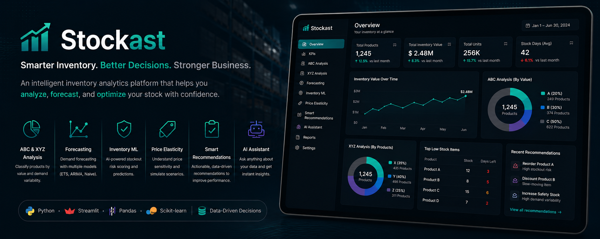
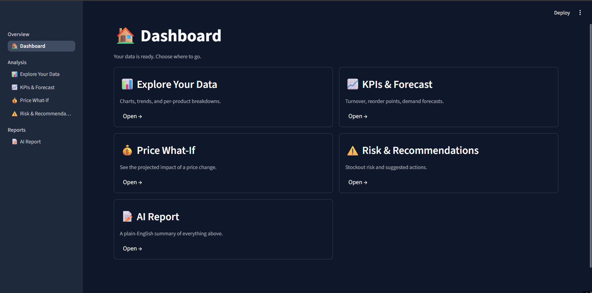

# 📦 StocKast — AI-Powered Inventory Intelligence Platform

<p align="center">    </p>

<p align="center">   <strong>Smarter Inventory. Better Decisions. Stronger Business.</strong> </p>

<p align="center">   StocKast turns raw inventory and sales data into a complete operational picture —   what's happening, what's likely to happen next, what's at risk,   and what to actually do about it. </p>

---

🔗 **Live demo:** *[Add your Streamlit Community Cloud URL here once deployed]*

---

## 📊 Dashboard

<p align="center">    </p>

---

## Why This Project Exists

Most portfolio data science projects are built around a single, fixed dataset.

StocKast is deliberately different: it is a **generic inventory intelligence platform**.

The same code that works on a small boutique retailer's spreadsheet can also work on a large wholesale dataset with tens of thousands of rows and hundreds of products — without hardcoding a single column name or business-specific assumption.

That constraint shaped almost every architectural decision in the project and is the central idea behind the design documented in `docs/`.

---

## What It Does

| Stage                    | What Happens                                                                                                                                                                                                                                                                         |
| ------------------------ | ------------------------------------------------------------------------------------------------------------------------------------------------------------------------------------------------------------------------------------------------------------------------------------ |
| **Upload & Map**         | Upload any CSV, Excel, or JSON file. Columns are automatically fuzzy-matched to a canonical schema, with a confirm-or-correct step before processing begins.                                                                                                                         |
| **Validate & Clean**     | 12 automated data-quality checks covering missing values, invalid types, outliers, insufficient history, and other issues, followed by transparent, rule-based cleaning. Every fix is logged; nothing is silently discarded.                                                         |
| **Explore**              | Automatic, dataset-adaptive charts and statistics at both dataset-wide and per-product levels, using only the fields actually available.                                                                                                                                             |
| **Statistical Analysis** | Descriptive statistics, hypothesis testing, correlation analysis, and distribution/normality testing.                                                                                                                                                                                |
| **KPIs**                 | Inventory turnover, Days of Inventory, ABC/XYZ classification, safety stock, reorder point, dead/slow-moving stock detection, and multi-period seasonality detection.                                                                                                                |
| **Forecasting**          | Per-product 14-day demand forecasts, automatically comparing Naive, Exponential Smoothing, and ARIMA models and selecting the best-performing approach using held-back historical data.                                                                                              |
| **Price Elasticity**     | Per-product price sensitivity estimated through log-log regression using real historical price variation, plus an interactive **what-if** tool combining elasticity with the demand forecast.                                                                                        |
| **ML Risk Prediction**   | A trained stockout-risk classifier using walk-forward, point-in-time features predicts risk per product, with SHAP-based explanations showing *why*. When the dataset cannot support genuine ML training, StocKast falls back to a transparent, clearly labeled rule-based estimate. |
| **Recommendations**      | Concrete, prioritized actions such as reordering, reducing inventory, discounting slow-moving products, increasing safety stock, or considering a price change.                                                                                                                      |
| **AI Report**            | Per-product or executive-summary narratives generated by an LLM that only narrates numbers and decisions already computed by StocKast — it does not analyze raw data or make independent business judgments.                                                                         |

---

## Architecture

```text
src/
│
├── data_loading/            CSV/Excel/JSON ingestion, encoding detection
├── schema_mapping/          Fuzzy column matching + confirm-and-apply
├── data_validation/         12 automated data-quality checks
├── data_cleaning/           Transparent, rule-based auto-cleaning
├── eda/                     Dataset-wide + per-product exploration
├── analytics/               Descriptive/hypothesis/correlation/distribution stats
├── kpis/                    Turnover, DOI, ABC/XYZ, safety stock, seasonality
├── forecasting/             Naive/ETS/ARIMA, fair model selection, per product
├── price_elasticity/        Elasticity estimation + what-if projection
├── inventory_ml/            Walk-forward stockout classifier + SHAP
├── recommendation_engine/  Rule-based fallback + prioritized actions
└── ai_assistant/            LLM-based report narration (Gemini)


app/
│
├── main.py                  Streamlit router (st.navigation)
├── state.py                 Session state + caching helpers
└── views/                   Onboarding, dashboard hub, and feature pages
```

### Why This Separation Matters

Every piece of actual business and data-science logic lives inside `src/`.

The `src/` layer:

* Has zero dependency on Streamlit.
* Can be independently tested.
* Can be reused by another interface.
* Keeps data science separate from presentation logic.

The entire `app/` layer could therefore be replaced with a different frontend — for example, a **FastAPI + React** architecture — without rewriting the underlying data-science modules.

---

## Key Design Decisions

Several architectural decisions were made intentionally to keep StocKast reliable across different datasets.

More details are available in `docs/design_decisions.md`.

### Optional Fields Are Never Fabricated

If a dataset does not contain `unit_cost`, cost-dependent metrics are honestly reported as unavailable.

StocKast never invents or guesses missing business information simply to produce a number.

### Outliers Are Flagged, Not Silently Dropped

A statistical outlier might represent a genuine demand spike rather than a data error.

Instead of automatically deleting it, StocKast surfaces the observation for review and keeps the cleaning process transparent.

### ML Only Runs When It Can Be Genuinely Trained

The stockout-risk model is only activated when the dataset contains enough historical information to construct meaningful labels.

Real stockout labels are derived from historical `current_stock` transitions. If the dataset cannot support a valid classifier, StocKast uses a clearly labeled rule-based fallback rather than pretending that a machine-learning model was trained.

### The LLM Never Reasons Independently

The `ai_assistant` module does not analyze the raw dataset.

Instead, it receives structured outputs produced by StocKast's own statistical, forecasting, ML, KPI, and recommendation modules and turns those existing facts into readable management-oriented narratives.

### Everything Degrades Gracefully

Every module checks whether the available data is sufficient before running.

Sparse or incomplete datasets do not cause the application to crash. Instead, individual features report clearly when they cannot produce a reliable result.

---

## Tech Stack

### Languages & Core Data

* Python
* Pandas
* NumPy

### Data Science & Machine Learning

* Scikit-learn
* Statsmodels
* pmdarima
* SHAP
* SciPy

### Visualization & Application

* Plotly
* Streamlit

### AI

* Google Gemini API

### Testing

* Pytest

---

## Running It Locally

### 1. Clone the Repository

```bash
git clone https://github.com/<your-username>/StocKast.git
cd StocKast
```

### 2. Install Dependencies

```bash
pip install -r requirements.txt
```

### 3. Configure the Gemini API Key

Get a Gemini API key from Google AI Studio.

#### Windows CMD

```bash
set GEMINI_API_KEY=your_key_here
```

#### PowerShell

```powershell
$env:GEMINI_API_KEY="your_key_here"
```

### 4. Run the Application

```bash
streamlit run app/main.py
```

The application will start locally and provide the Streamlit URL in the terminal.

---

## Testing

Run the complete test suite with:

```bash
python -m pytest tests/ -v
```

The project currently contains **132 tests** covering the modules in `src/`, including:

* Happy paths
* Edge cases
* Sparse and incomplete datasets
* Graceful-degradation behavior
* ML fallback behavior
* Forecasting behavior
* Recommendation rules
* Data validation and cleaning
* Bugs discovered and fixed during development

Additional implementation and design notes are available in `docs/`.

---

## Roadmap / V2

StocKast v1 is a complete, tested, Streamlit-based inventory intelligence platform.

A potential V2 would focus primarily on **productionization, scalability, and stronger AI capabilities**, while reusing the existing `src/` intelligence layer.

### Planned Architecture & Improvements

* **FastAPI backend** exposing the existing `src/` functionality through API endpoints
* **User authentication** and per-user data isolation
* **PostgreSQL** for persistent application data
* **React / Next.js frontend** replacing Streamlit
* **Dockerized deployment**
* **Cloud deployment**
* **Stronger LLM integration** using a more capable model for richer executive summaries, deeper business explanations, and more natural conversational interactions
* **Conversational Q&A** built on top of the existing structured analytics and AI report generation pipeline
* **LLM model selection / configuration** allowing the AI layer to use different models depending on the task, cost, latency, and required reasoning capability

The goal would not be to rewrite the core intelligence layer. Instead, V2 would expose the existing architecture as a production-ready service while making the AI layer more capable and interactive.

---

## Project Structure

```text
StocKast/
│
├── app/
│   ├── main.py
│   ├── state.py
│   └── views/
│
├── src/
│   ├── data_loading/
│   ├── schema_mapping/
│   ├── data_validation/
│   ├── data_cleaning/
│   ├── eda/
│   ├── analytics/
│   ├── kpis/
│   ├── forecasting/
│   ├── price_elasticity/
│   ├── inventory_ml/
│   ├── recommendation_engine/
│   └── ai_assistant/
│
├── tests/
│
├── docs/
│   ├── screenshots/
│   │   ├── 01_project_banner.png
│   │   └── 02_dashboard.png
│   └── design_decisions.md
│
├── requirements.txt
└── README.md
```

---

## License

*Add your chosen license here, such as MIT.*
